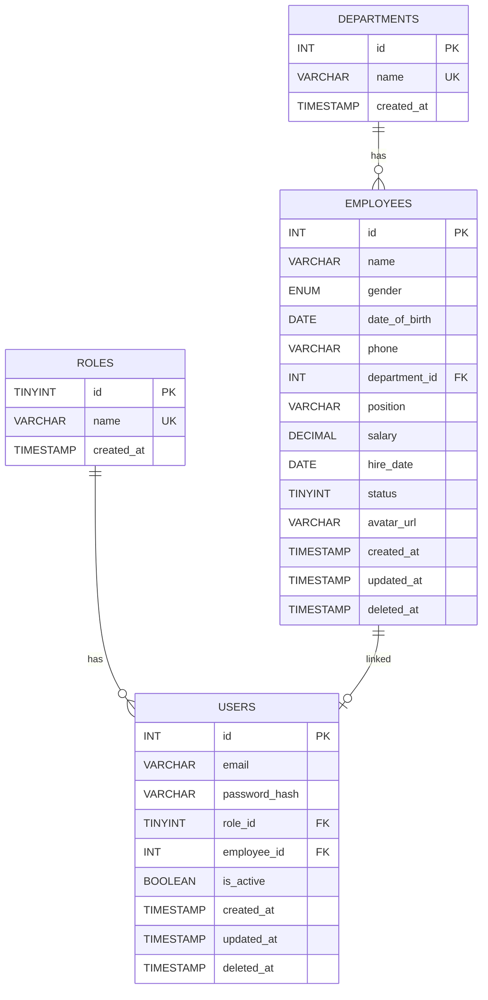

# 🏢 Employee Management System

> Hệ thống Quản lý Nhân sự nội bộ với **Vue 3** + **Golang (Gin)** + **MySQL**

---

## 📋 Mục lục

1. [Tổng quan dự án](#1-tổng-quan-dự-án)
2. [Công nghệ sử dụng](#2-công-nghệ-sử-dụng)
3. [Cấu trúc thư mục](#3-cấu-trúc-thư-mục)
4. [Database Schema](#4-database-schema)
5. [API Documentation](#5-api-documentation)
6. [Setup & Run](#6-setup--run)
7. [Troubleshooting](#7-troubleshooting)

---

## 1. Tổng quan dự án

Xây dựng hệ thống quản lý nhân sự nội bộ cho doanh nghiệp, hỗ trợ Admin quản lý thông tin nhân viên, tài khoản người dùng, phòng ban và theo dõi thống kê qua Dashboard.

**Chức năng chính:**

**Chức năng chính:**

| Tính năng                                |     Admin     |     User      |
| ---------------------------------------- | :-----------: | :-----------: |
| Đăng nhập / Đăng xuất (JWT)              |      ✅       |      ✅       |
| Dashboard thống kê                       |  ✅ (đầy đủ)  |  ✅ (cơ bản)  |
| Xem danh sách nhân viên                  | ✅ (có lương) | ✅ (ẩn lương) |
| Tìm kiếm & lọc theo phòng ban            |      ✅       |      ✅       |
| Thêm / Sửa / Xoá nhân viên (soft delete) |      ✅       |      ❌       |
| Xem hồ sơ cá nhân                        |      ✅       |      ✅       |
| Quản lý tài khoản (CRUD, phân quyền)     |      ✅       |      ❌       |
| Cấp tài khoản nhanh cho nhân viên        |      ✅       |      ❌       |

**Kiến trúc:**

```
┌─────────────────┐         ┌──────────────────┐         ┌─────────┐
│   Vue 3 (SPA)   │◄──API──►│  Golang (Gin)    │◄──ORM──►│  MySQL  │
│   Port: 3000    │         │  Port: 8080      │         │  :3306  │
│   Vite + Pinia  │         │  GORM + JWT      │         │         │
└─────────────────┘         └──────────────────┘         └─────────┘
```

---

## 2. Công nghệ sử dụng

### Frontend

| Công nghệ              | Vai trò                          |
| ---------------------- | -------------------------------- |
| **Vue 3** (^3.5)       | Framework SPA (Composition API)  |
| **Vite** (^8.0)        | Build tool & Dev server          |
| **Vue Router** (^5.0)  | Điều hướng SPA, navigation guard |
| **Pinia** (^3.0)       | State management                 |
| **Axios** (^1.15)      | HTTP client                      |
| **vue-toastification** | Thông báo toast UI               |

### Backend

| Công nghệ               | Vai trò                              |
| ----------------------- | ------------------------------------ |
| **Go 1.26 + Gin v1.12** | Web framework                        |
| **GORM v1.31**          | ORM cho MySQL (AutoMigrate, Preload) |
| **golang-jwt/jwt v5**   | Tạo & xác thực JWT token             |
| **bcrypt**              | Hash mật khẩu                        |
| **godotenv**            | Load biến môi trường từ `.env`       |
| **gin-contrib/cors**    | Xử lý CORS                           |

### Infrastructure

| Công nghệ          | Vai trò                           |
| ------------------ | --------------------------------- |
| **Docker Compose** | Container hóa MySQL + Backend     |
| **MySQL 8.0**      | Database chính                    |
| **Postman**        | Test & quản lý API endpoints      |
| **DBeaver**        | Quản lý và truy vấn cơ sở dữ liệu |

---

## 3. Cấu trúc thư mục

### Backend (`backend/`)

```
backend/
├── main.go                 # Entry point
├── config/config.go        # LoadEnv() + ConnectDB()
├── database/database.go    # MigrateModels() + Seed()
├── models/                 # Role, Department, Employee, User
├── dto/                    # Input/Output DTOs
├── handlers/               # auth, me, dashboard, department, employee, user
├── middleware/             # JWT, AdminOnly, ErrorHandler
├── routes/routes.go        # Định nghĩa API routes
├── utils/response.go       # Helper responses
└── db_em.sql               # SQL schema tham khảo
```

### Frontend (`frontend/`)

```
frontend/src/
├── api/index.js            # Axios instance + interceptors
├── router/index.js         # Routes + Navigation Guards
├── stores/                 # auth, employee, user, dashboard, department, ui
├── layouts/MainLayout.vue  # Sidebar + Header + RouterView
├── components/             # AppHeader, AppSidebar, EmployeeForm
└── views/                  # Login, Dashboard, EmployeeList, Profile, UserManagement
```

---

## 4. Database Schema



```
Notes:
- role_id → roles.id
- department_id → departments.id
- employee_id → employees.id (1-1 relationship)
- deleted_at dùng cho soft delete
- status: 1 = active, 0 = inactive
```

**Chi tiết quan hệ**

| Quan hệ                                      | Loại         | Mô tả                             | On Delete |
| -------------------------------------------- | ------------ | --------------------------------- | --------- |
| `users.role_id` → `roles.id`                 | N:1          | Mỗi user có 1 role                | RESTRICT  |
| `users.employee_id` → `employees.id`         | 1:1 (UNIQUE) | Mỗi employee chỉ có tối đa 1 user | SET NULL  |
| `employees.department_id` → `departments.id` | N:1          | Nhiều employee thuộc 1 department | SET NULL  |

**Phân quyền:**

| Role    | Quyền hạn                                                         |
| ------- | ----------------------------------------------------------------- |
| `admin` | Toàn quyền: CRUD employee & user, xem salary, dashboard đầy đủ    |
| `user`  | Xem danh sách employee (ẩn salary), xem profile, dashboard cơ bản |

**Seed data**

- **Roles**: `admin`, `user`
- **Departments**: IT, HR, Finance, Marketing, Sales, Operations
- **Employees**: 40 nhân viên mẫu (tên tiếng Việt)
- **Admin**: `chiquoc64@admin.company.dev` / `admin123`
- **Users**: Tự động tạo từ tên nhân viên, mật khẩu mặc định `123456`

> Seed chỉ chạy khi `SEEDDATA=true` trong `.env`

---

## 5. API Documentation

**Base URL**: `http://localhost:8080/api`  
Mọi route (trừ `/auth/login`) yêu cầu header `Authorization: Bearer <token>`.  
Các route ghi/xoá `/employees` và toàn bộ `/users` yêu cầu thêm role `admin`.

| Method | Endpoint         | Mô tả                                           |     Admin      |      User      |
| ------ | ---------------- | ----------------------------------------------- | :------------: | :------------: |
| POST   | `/auth/login`    | Đăng nhập, trả JWT token                        |       ✅       |       ✅       |
| GET    | `/auth/me`       | Thông tin user hiện tại                         |       ✅       |       ✅       |
| GET    | `/dashboard`     | Thống kê tổng quan                              |   ✅ (full)    |  ✅ (cơ bản)   |
| GET    | `/departments`   | Danh sách phòng ban                             |       ✅       |       ✅       |
| GET    | `/employees`     | Danh sách nhân viên (phân trang, tìm kiếm, lọc) | ✅ (có salary) | ✅ (ẩn salary) |
| GET    | `/employees/:id` | Chi tiết nhân viên                              |       ✅       |       ✅       |
| POST   | `/employees`     | Tạo nhân viên                                   |       ✅       |       ❌       |
| PUT    | `/employees/:id` | Cập nhật nhân viên                              |       ✅       |       ❌       |
| DELETE | `/employees/:id` | Xoá mềm nhân viên                               |       ✅       |       ❌       |
| GET    | `/users`         | Danh sách tài khoản                             |       ✅       |       ❌       |
| GET    | `/users/:id`     | Chi tiết tài khoản                              |       ✅       |       ❌       |
| POST   | `/users`         | Tạo tài khoản                                   |       ✅       |       ❌       |
| PUT    | `/users/:id`     | Cập nhật tài khoản                              |       ✅       |       ❌       |
| DELETE | `/users/:id`     | Xoá mềm tài khoản                               |       ✅       |       ❌       |

---

## 6. Setup & Run

**Yêu cầu**

- **Go** ≥ 1.26
- **Node.js** ≥ 18
- **MySQL** 8.0
- **Docker** (optional)

```bash
git clone https://github.com/Quocdev03/Employee_Management.git
cd Employee_Management
```

### Backend

```bash
cd backend
# Chỉnh backend/.env nếu cần (DB_HOST, DB_USER, DB_PASSWORD, JWT_SECRET...)
# Đặt SEEDDATA=true để seed dữ liệu mẫu lần đầu
go mod tidy
go run main.go
# → http://localhost:8080
```

### Frontend

```bash
cd frontend
npm install
npm run dev
# → http://localhost:3000
```

### Docker

```bash
# Từ thư mục gốc
docker-compose up --build
```

Sẽ khởi tạo:

- **MySQL** container (`mysql-employee_db`) — port 3306
- **Go App** container (`go-app`) — port 8080

### Tài khoản mặc định (sau khi seed)

| Loại      | Email                         | Password   |
| --------- | ----------------------------- | ---------- |
| **Admin** | `chiquoc64@admin.company.dev` | `admin123` |

---

## 7. Troubleshooting

**Port conflict**

```bash
netstat -ano | findstr :8080   # Windows
taskkill /PID <PID> /F
# Hoặc đổi port trong .env / vite.config.js
```

**MySQL connection refused**

```bash
mysql -u root -p -e "CREATE DATABASE IF NOT EXISTS employee_db;"
# Kiểm tra DB_HOST, DB_PORT, DB_USER, DB_PASSWORD trong backend/.env
```

**`npm install` lỗi**

```bash
rm -rf node_modules package-lock.json
npm cache clean --force && npm install
```

**`go mod tidy` lỗi**

```bash
go clean -modcache && go mod tidy
```

**Docker cache lỗi**

```bash
docker-compose down -v
docker-compose build --no-cache && docker-compose up
```

**CORS / API không gọi được**

- Kiểm tra `VITE_API_URL` trong `frontend/.env` trỏ đúng backend
- Backend hỗ trợ CORS cho `localhost:3000`, `localhost:5173`, `localhost:4200`

**Token hết hạn / 401 liên tục**

- JWT hết hạn sau 48h → đăng nhập lại
- Nếu DB reset mà token cũ còn → xoá localStorage trong browser DevTools

---

> **Tác giả**: Cao Chí Quốc
